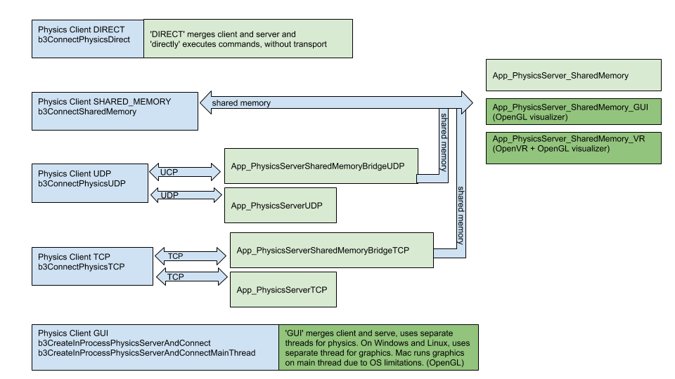

# PyBullet Quickstart Guide

これは *Erwin Coumans*, *Yunfei Bai* によって書かれた[PyBullet Quickstart Guide](https://docs.google.com/document/d/10sXEhzFRSnvFcl3XxNGhnD4N2SedqwdAvK3dsihxVUA/edit#)の和訳です。

## 前書き

PyBulletは、ロボットシミュレーションと機械学習用の高速で使いやすいPythonモジュールであり、simからrealへの転送に重点を置いています。  
PyBulletを使用すると、URDF、SDF、MJCF、およびその他のファイル形式から関節式ボディをロードできます。  
PyBulletは、順方向ダイナミクスシミュレーション、逆方向ダイナミクス計算、順方向および逆方向の運動学、衝突検出、光線交差クエリを提供します。  
[Bullet Physics SDK](http://github.com/bulletphysics/bullet3) には、シミュレートされたMinitaur四足動物、TensorFlow推論を使用して実行されるヒューマノイド、オブジェクトをつかむKUKAアームなどのPyBulletロボットの例が含まれています。  
縮小座標マルチボディ、リジッドボディ、および変形可能オブジェクトは、[この論文](https://drive.google.com/file/d/0Bz3vEa19XOYGNWdZWGpMdUdqVmZ5ZVBOaEh4ZnpNaUxxZFNV/view?usp=sharing)と同様に、統合されたLCP制約ソルバーによって処理されます。


物理シミュレーションとは別に、CPUレンダラー(TinyRenderer)とOpenGL 3.xのレンダリングと視覚化、およびHTCViveやOculusRiftなどのバーチャルリアリティヘッドセットのサポートにより、レンダリングへのバインドがあります。  
PyBulletには、衝突検出クエリ(最も近い点、オーバーラップペア、光線交差テストなど)を実行し、デバッグレンダリング(デバッグラインとテキスト)を追加する機能もあります。 PyBulletには、共有メモリ、UDP、およびTCPネットワーク用のクロスプラットフォームの組み込みクライアントサーバーサポートがあります。そのため、WindowsVRサーバーに接続しているLinuxでPyBulletを実行できます。  

PyBulletは [新しいBulletC-API](https://github.com/bulletphysics/bullet3/blob/master/examples/SharedMemory/PhysicsClientC_API.h) をラップします。  
これは、基盤となる物理エンジンおよびレンダリングエンジンから独立するように設計されているため、新しいバージョンのBulletに簡単に移行したり、別の物理エンジンやレンダリングエンジンを使用したりできます。  
デフォルトでは、PyBulletはCPUでBullet 2.xAPIを使用します。  
OpenCLを使用してGPUで実行されているBullet3.xも公開します。  
PyBulletに似たC ++ APIもあります。  
[b3RobotSimulatorClientAPI](https://github.com/bulletphysics/bullet3/blob/master/examples/RobotSimulator/b3RobotSimulatorClientAPI.h)を参照してください。

PyBulletは、TensorFlowおよびOpenAIGymで簡単に使用できます。  
[Google Brain](https://sites.google.com/corp/view/graspgan) [[1](https://arxiv.org/abs/1804.10332),[2](https://sites.google.com/corp/view/graspgan),[3](https://xcyan.github.io/geoaware_grasping/),[4](https://arxiv.org/abs/1712.07642)]、[X](https://sites.google.com/corp/view/multi-task-domain-adaptation) [[1](https://sim2real.github.io/assets/slides/bai-Learning_to_Grasp_Using_Simulation_Yunfei_Bai_Google_X.pdf),[2](https://www.linkedin.com/pulse/speeding-up-robot-learning-100x-simulation-mrinal-kalakrishnan/)]、Stanford AI Lab [[1](https://stanfordvl.github.io/ntp/?utm_content=buffer8b1fc),[2](http://gibsonenv.stanford.edu),[3](http://gibson.vision/)]、[OpenAI](https://blog.openai.com/roboschool/)、INRIA [[1](https://openlab-flowers.inria.fr/t/state-representation-learning-for-reinforcement-learning-srl-for-rl/405)]、 [および他の多くのラボの研究者](https://scholar.google.com/scholar?oi=bibs&hl=en&cites=14155418983690238411,15548795680127842422,12750085261778447071) がPyBulletを使用しています。  
研究でPyBulletを使用している場合は、[引用](https://docs.google.com/document/d/10sXEhzFRSnvFcl3XxNGhnD4N2SedqwdAvK3dsihxVUA/edit#bookmark=id.c5k8j1j6kny9)を追加してください。

PyBulletのインストールは、

(Python 2.x)

```sh
(sudo)pip install pybullet
```

(Python 3.x)

```sh
pip3 install pybullet
```

と同じくらい簡単です。  
これにより、PyBulletモジュールとpybullet_envs gym 環境が公開されます。  

### Hello PyBullet World

これがステップバイステップで説明したPyBulletの紹介スクリプトです。

```python
import pybullet as p
import time
import pybullet_data
physicsClient = p.connect(p.GUI)#or p.DIRECT for non-graphical version
p.setAdditionalSearchPath(pybullet_data.getDataPath()) #optionally
p.setGravity(0,0,-10)
planeId = p.loadURDF("plane.urdf")
cubeStartPos = [0,0,1]
cubeStartOrientation = p.getQuaternionFromEuler([0,0,0])
boxId = p.loadURDF("r2d2.urdf",cubeStartPos, cubeStartOrientation)
for i in range (10000):
    p.stepSimulation()
    time.sleep(1./240.)
cubePos, cubeOrn = p.getBasePositionAndOrientation(boxId)
print(cubePos,cubeOrn)
p.disconnect()
```

### connect, disconnect

PyBulletモジュールをインポートした後、最初に行うことは、物理シミュレーションに「接続」することです。  
PyBulletは、クライアントサーバー駆動型APIを中心に設計されており、クライアントがコマンドを送信し、物理サーバーがステータスを返します。  
PyBulletには、DIRECTとGUIの物理サーバーが組み込まれています。GUI接続とDIRECT接続はどちらも、PyBulletと同じプロセスで物理シミュレーションとレンダリングを実行します。  
  
ダイレクトモードでは、「バーチャルリアリティ」および「デバッグGUI、ライン、テキスト、パラメータ」の章で説明されているように、OpenGLおよびVRハードウェア機能にアクセスできないことに注意してください。  
DIRECTモードでは、「getCameraImage」APIを介して組み込みのソフトウェアレンダラーを使用して画像をレンダリングできます。これは、GPUのないサーバー上のクラウドでシミュレーションを実行する場合に役立ちます。

独自のデータファイルを提供することも、PyBulletに付属のPyBullet_dataパッケージを使用することもできます。このためには、pybullet_dataをインポートし、`pybullet.setAdditionalSearchPath(pybullet_data.getDataPath())`を使用してディレクトリを登録します。

#### getConnectionInfo

与えられたphysicsClientIdはリスト`[isConnected, connectionMethod]`を返します。

#### isConnected

isConnectedは、physicsClientIdを指定すると、接続されている場合は`true`を返し、そうでない場合は`false`を返します。

#### setTimeOut

コマンドが特定のタイムアウト値内にサーバーによって処理されない場合、クライアントは切断されます。  
`setTimeOut`を使用して、この値を秒単位で指定します。
<figure>
    
    <figcaption>さまざまな物理クライアント(青)と物理サーバー(緑)のオプションを使用した図。濃い緑色のサーバーは、OpenGLデバッグの視覚化を提供します。</figcaption>
</figule>

#### DIRECT, GUI を使用した接続

DIRECT接続は、トランスポート層やグラフィックス視覚化ウィンドウを使用せずに、コマンドを物理エンジンに直接送信し、コマンドの実行後にステータスを直接返します。  
  
GUI接続は、PyBulletと同じプロセス空間内に、3D OpenGLレンダリングを備えた新しいグラフィカルユーザーインターフェイス(GUI)を作成します。  
LinuxとWindowsでは、このGUIは別のスレッドで実行されますが、OSXでは、オペレーティングシステムの制限により、同じスレッドで実行されます。  
Mac OSXでは、`stepSimulation` または他のPyBulletコマンドを実行するまで、OpenGLウィンドウにスピニングホイールが表示される場合があります。  
コマンドとステータスメッセージは、通常のメモリバッファを使用して、PyBulletクライアントとGUI物理シミュレーションサーバーの間で送信されます。

SHARED_MEMORY、UDP、またはTCPネットワークを使用して、同じマシンまたはリモートマシン上の異なるプロセスで物理サーバーに接続することもできます。  
詳細については、共有メモリ、UDP、およびTCPに関するセクションを参照してください。  
  

他のほとんどすべてのメソッドとは異なり、このメソッドは下位互換性のためにキーワード引数を解析しません。  
  

接続入力引数は次のとおりです。  

<table>
    <tr>
        <td>required</td>
        <td>connection mode</td>
        <td>integer: <br/>
            DIRECT,<br/>
            GUI,<br/>
            SHARED_MEMORY,<br/>
            UDP,<br/>
            TCP,<br/>
            GUI_SERVER,<br/>
            SHARED_MEMORY_SERVER,<br/>
            SHARED_MEMORY_GUI
        </td>
        <td>DIRECTモードは、新しい物理エンジンを作成し、それと直接通信します。<br/>
            GUIは、グラフィカルGUIフロントエンドを備えた物理エンジンを作成し、それと通信します。<br/>
            SHARED_MEMORYは、同じマシン上の既存の物理エンジンプロセスに接続し、共有メモリを介して通信します。<br/>
            TCPまたはUDPは、TCPまたはUDPネットワークを介して既存の物理サーバーに接続します。<br/>
            GUI_SERVERはGUIに似ていますが、外部SHARED_MEMORY接続を許可するサーバーとしても機能します。<br/>
            SHARED_MEMORY_SERVERはDIRECTに似ていますが、外部のSHARED_MEMORY接続を許可するサーバーとしても機能します。<br/>
            SHARED_MEMORY_GUIはDIRECTに似ていますが、表示のために外部グラフィックサーバーに接続しようとします。<br/>
            Bullet ExampleBrowserには、PhysicsServerまたはGraphicsServerとして機能するオプションがあります。
        </td>
    </tr>
    <tr>
        <td>optional</td>
        <td>key</td>
        <td>integer</td>
        <td>SHARED_MEMORYモードでは、オプションの共有メモリキー、
            ExampleBrowserまたはSharedMemoryPhysics_*を起動するときは、オプションのコマンドライン--shared_memory_keyを使用してキーを設定できます。<br/>
            これにより、同じマシンで複数のサーバーを実行できます。
        </td>
    </tr>
    <tr>
        <td>optional</td>
        <td>hostName<br/>(UDP and TCP)</td>
        <td>string</td>
        <td>IPアドレスまたはホスト名<br/>>(例：「127.0.0.1」または「localhost」または「mymachine.domain.com」)</td>
    </tr>
    <tr>
        <td>optional</td>
        <td>port<br/>(UDP and TCP)</td>
        <td>integer</td>
        <td>
            UDPポート番号。デフォルトのUDPポートは1234、デフォルトのTCPポートは6667(サーバーのデフォルトと一致)
        </td>
    </tr>
    <tr>
        <td>optional</td>
        <td>options</td>
        <td>string</td>
        <td>
            GUIサーバーに渡されるコマンドラインオプション。現時点では、-opengl2フラグのみが有効になっています。デフォルトでは、BulletはOpenGL3を使用しますが、仮想マシンやリモートデスクトップクライアントなどの一部の環境はOpenGL2のみをサポートします。現在、渡すことができるコマンドライン引数は1つだけです。
        </td>
    </tr>
</table>
  

connectは、物理クライアントIDを返します。接続されていない場合は-1を返します。  
物理クライアントIDは、他のほとんどのPyBulletコマンドに対するオプションの引数です。指定しない場合、物理クライアントID = 0と見なされます。  
GUIを除く複数の異なる物理サーバーに接続できます。

例えば：

```python
pybullet.connect(pybullet.DIRECT)
pybullet.connect(pybullet.GUI, options="--opengl2")
pybullet.connect(pybullet.SHARED_MEMORY,1234)
pybullet.connect(pybullet.UDP,"192.168.0.1")
pybullet.connect(pybullet.UDP,"localhost", 1234)
pybullet.connect(pybullet.TCP,"localhost", 6667)
```

#### Shared Memory を使用した接続

共有メモリ接続を許可するいくつかの物理サーバーがあります。  
App_SharedMemoryPhysics、App_SharedMemoryPhysics_GUI、およびBullet Example Browserには、共有メモリ接続を許可するExperimental / PhysicsServerの下に1つの例があります。  
これにより、物理シミュレーションとレンダリングを別々のプロセスで実行できます。  
  
共有メモリを介してApp_SharedMemoryPhysics_VRに接続することもできます。これは、ヘッドマウントディスプレイと、HTCViveやOculusRift withTouchコントローラーなどの6自由度の追跡コントローラーをサポートするバーチャルリアリティアプリケーションです。  
Valve OpenVR SDKはWindowsでのみ正しく機能するため、App_SharedMemoryPhysics_VRは、premake(できれば)またはcmakeを使用してWindowsでのみビルドできます。

#### UDP or TCP ネットワーキングを使用した接続

UDPネットワーキングの場合、特定のUDPポートをListenするApp_PhysicsServerUDPがあります。信頼性の高いUDPネットワーキングのためにオープンソースのenetライブラリを使用します。これにより、物理シミュレーションとレンダリングを別のマシンで実行できます。 TCPの場合、PyBulletはclsocketライブラリを使用します。これは、ファイアウォールの背後にあるマシンからロボットシミュレーションへのSSHトンネリングを使用する場合に役立ちます。たとえば、LinuxでPyBulletを使用して制御スタックまたは機械学習を実行し、HTCViveまたはRiftを使用して仮想現実でWindowsで物理サーバーを実行できます。  
  
もう1つのUDPアプリケーションは、既存の物理サーバーへのブリッジとして機能するApp_PhysicsServerSharedMemoryBridgeUDPアプリケーションです。UDPを介してこのブリッジに接続でき、ブリッジは共有メモリを使用して物理サーバーに接続します。ブリッジはクライアントとサーバー間でメッセージを渡します。同様に、TCPバージョンがあります(UDPをTCPに置き換えます)。

GRPCクライアントとサーバーのサポートもありますが、デフォルトでは有効になっていません。 --enable_grpcオプションを使用してpremake4ビルドシステムを使用して試すことができます(Bullet/build3/premake4を参照)。

注：現時点では、クライアントとサーバーの両方が32ビットまたは64ビットのビルドである必要があります。

#### disconnect

connectの呼び出しによって返された物理クライアントIDを使用して、物理サーバーから切断できます(負でない場合)。 「DIRECT」または「GUI」物理サーバーがシャットダウンします。別の(プロセス外の)物理サーバーが実行を継続します。すべてのアイテムを削除するには、「resetSimulation」も参照してください。

disconnectのパラメータ：

<table>
    <tr>
    <td>optional</td>
    <td>physicsClientId</td>
    <td>int</td>
    <td>複数の物理サーバーに接続する場合は、どれかを選択できます。</td>
    </tr>
</table>

### setGravity

デフォルトでは、重力は有効になっていません。  
setGravityを使用すると、すべてのオブジェクトのデフォルトの重力を設定できます。
setGravity入力パラメーターは次のとおりです:(戻り値なし)


<table>
    <tr>
        <td>required</td>
        <td>graX</td>
        <td>float</td>
        <td>World座標のX軸に沿った重力</td>
    </tr>
    <tr>
        <td>required</td>
        <td>graY</td>
        <td>float</td>
        <td>World座標のY軸に沿った重力</td>
    </tr>
    <tr>
        <td>required</td>
        <td>graZ</td>
        <td>float</td>
        <td>World座標のZ軸に沿った重力</td>
    </tr>
    <tr>
        <td>optional</td>
        <td>physicsClientId</td>
        <td>int</td>
        <td>複数の物理サーバーに接続する場合は、いずれかを選択できます。</td>
    </tr>
</table>

### loadURDF, loadSDF, loadMJCF

loadURDFは、Universal Robot Description File(URDF)から物理モデルをロードするコマンドを物理サーバーに送信します。 URDFファイルは、ROSプロジェクト(Robot Operating System)がロボットやその他のオブジェクトを記述するために使用され、WillowGarageとOpen Source Robotics Foundation(OSRF)によって作成されました。多くのロボットには公開URDFファイルがあります。説明とチュートリアルはここにあります:[http://wiki.ros.org/urdf/Tutorials](http://wiki.ros.org/urdf/Tutorials)

重要な注意：ほとんどのジョイント(スライダー、回転、連続)では、自由な動きを防ぐモーターがデフォルトで有効になっています。これは、非常に高摩擦のハーモニックドライブを備えたロボットジョイントに似ています。 `pybullet.setJointMotorControl2` を使用して、ジョイントモーター制御モードとターゲット設定を設定する必要があります。詳細については、`setJointMotorControl2API` を参照してください。

警告：デフォルトでは、PyBulletは読み込みを高速化するためにいくつかのファイルをキャッシュします。 setPhysicsEngineParameter(enableFileCaching = 0)を使用して、ファイルキャッシュを無効にできます。

loadURDFの引数は次のとおりです。


<table>
    <tr>
        <td>required</td>
        <td>fileName</td>
        <td>string</td>
        <td>物理サーバーのファイルシステム上のURDFファイルへの相対パスまたは絶対パス。</td>
    </tr>
    <tr>
        <td>optional</td>
        <td>basePosition</td>
        <td>vec3</td>
        <td>ワールド空間座標[X、Y、Z]の指定された位置にあるオブジェクトのベースを再現します。この位置はURDFリンク位置であることに注意してください。慣性フレームがゼロ以外の場合、これは重心位置とは異なります。 resetBasePositionAndOrientationを使用して、重心の位置/方向を設定します。</td>
    </tr>
    <tr>
        <td>optional</td>
        <td>baseOrientation</td>
        <td>vec4</td>
        <td>オブジェクトのベースを、ワールドスペースクォータニオン[X、Y、Z、W]として指定された方向に作成します。 basePositionの注を参照してください。</td>
    </tr>
    <tr>
        <td>optional</td>
        <td>useMaximalCoordinates</td>
        <td>int</td>
        <td>
            (実験的)<br/>
            デフォルトでは、URDFファイルのジョイントは、縮小座標法を使用して作成されます。<br/>
            ジョイントは、Featherstone Articulated Body Algorithm（ABA、Bullet 2.xのbtMultiBody）を使用してシミュレートされます。 <br/>
            useMaximalCoordinatesオプションは、リンクごとに6自由度のリジッドボディを作成し、これらのリジッドボディ間の拘束を使用してジョイントをモデル化します。</td>
    </tr>
    <tr>
        <td>optional</td>
        <td>useFixedBase</td>
        <td>int</td>
        <td>ロードされたオブジェクトのベースを強制的に静的にします</td>
    </tr>
    <tr>
        <td>optional</td>
        <td>flags</td>
        <td>int</td>
        <td>
            <p>次のフラグは、ビットごとのOR、|を使用して組み合わせることができます。</p>
            <strong>URDF_MERGE_FIXED_LINKS：</strong>
            <p>
                これにより、URDFファイルから固定リンクが削除され、結果のリンクがマージされます。<br/>
                さまざまなアルゴリズム（関節式ボディアルゴリズム、順運動学など）は、<br/>
                固定ジョイントを含むジョイントの数が線形的に複雑であるため、これはパフォーマンスに優れています。
            </p>                        
            <strong>URDF_USE_INERTIA_FROM_FILE：</strong>
            <p>
                デフォルトでは、Bulletは衝突形状の質量と体積に基づいて慣性テンソルを再計算しました。<br/>
                より正確な慣性テンソルを提供できる場合は、このフラグを使用してください。
            </p>
            <strong>URDF_USE_SELF_COLLISION：</strong>
            <p>
                デフォルトでは、Bulletは自己衝突を無効にします。このフラグで有効にできます。<br/>
                次のフラグを使用して、自己衝突動作をカスタマイズできます。
            </p>
            <strong>URDF_USE_SELF_COLLISION_INCLUDE_PARENT</strong>
            <p>
                子と親の間の衝突を有効にします。デフォルトでは無効になっています。<br/>
                <code>URDF_USE_SELF_COLLISION</code> フラグと一緒に使用する必要があります。
            </p>
            <strong>URDF_USE_SELF_COLLISION_EXCLUDE_ALL_PARENTS</strong>
            <p>
                子リンクとその祖先（親、親の親、ベースまで）の間の自己衝突を破棄します。 <br/>
                <code>URDF_USE_SELF_COLLISION</code>と一緒に使用する必要があります。
            </p>
            <strong>URDF_USE_IMPLICIT_CYLINDER</strong>
            <p>滑らかな暗黙の円柱を使用します。デフォルトでは、Bulletは円柱を凸包にテッセレートします。</p>
            <strong>URDF_ENABLE_SLEEPING</strong>
            <p>
                ボディがしばらく動かなかった後にシミュレーションを無効にすることを可能にします。<br/>
                アクティブボディとの相互作用により、シミュレーションが再び有効になります。
            </p>
            <strong>URDF_INITIALIZE_SAT_FEATURES</strong>
            <p>
                凸形状の三角形メッシュを作成します。<br/>
                これにより、視覚化が向上し、GJK / EPAの代わりに分離軸テスト（SAT）を使用できるようになります。<br/>
                setPhysicsEngineParameterを使用してSATを有効にする必要があります。
            </p>
            <strong>URDF_USE_MATERIAL_COLORS_FROM_MTL</strong>
            <p>
                URDFファイルからではなく、WavefrontOBJファイルからのRGBカラーを使用します。
            </p>
            <strong>URDF_ENABLE_CACHED_GRAPHICS_SHAPES</strong>
            <p>
                グラフィックシェイプをキャッシュして再利用します。<br/>
                同様のグラフィックアセットを持つファイルの読み込みパフォーマンスが向上します。
            </p>
            <strong>URDF_MAINTAIN_LINK_ORDER</strong>
            <p>
                URDFファイルからのリンク順序を維持しようとします。URDFファイルで言うと、順序は、<br/>
                ParentLink0、ChildLink1（ParentLink0に接続）、ChildLink2（ParentLink0に接続）です。<br/>
                このフラグがない場合、順序はP0、C2、C1になる可能性があります。
            </p>
        </td>
    </tr>
    <tr>
        <td>optional</td>
        <td>globalScaling</td>
        <td>float</td>
        <td>globalScalingは、スケール係数をURDFモデルに適用します。</td>
    </tr>
    <tr>
        <td>optional</td>
        <td>physicsClientId</td>
        <td>int</td>
        <td>複数のサーバーに接続している場合は、1つを選択できます。</td>
    </tr>
</table>

loadURDFは、本体の一意のID、負でない整数値を返します。
URDFファイルをロードできない場合、この整数は負になり、有効な本体の一意のIDではありません。
デフォルトでは、loadURDFはメッシュの衝突検出に凸包を使用します。
静的（mass= 0、移動しない）メッシュの場合、URDFにタグを追加する: `<linkconcavent = "yes" name = "baseLink">`  ことで、メッシュを凹面にすることができます。
例については、[samurai.urdf](https://github.com/bulletphysics/bullet3/blob/master/data/samurai.urdf)を参照してください。 
URDF形式には他にもいくつかの拡張機能があり、例をブラウザーで調べることができます。 
PyBulletは、URDFファイルのすべての情報を処理するわけではありません。
サポートされている機能については、例とURDFファイルを参照してください。
通常、機能を制御する代わりにPythonAPIがあります。
各リンクには単一のマテリアルしか含めることができないため、マテリアルが異なる複数の視覚的な形状がある場合は、
それらを別々のリンクに分割し、固定ジョイントで接続する必要があります。 
Bulletの一部であるOBJ2SDFユーティリティを使用してこれを行うことができます。

#### loadSDF, loadMJCF

.bullet、.sdf、.mjcfなどの他のファイル形式からオブジェクトをロードすることもできます。
これらのファイル形式は複数のオブジェクトをサポートしているため、戻り値はオブジェクトの一意のIDのリストです。
SDF形式については、[http://sdformat.org](http://sdformat.org)で詳しく説明されています。 
`loadSDF`コマンドは、ロボットのモデルとジオメトリに関連するSDFの一部の重要な部分のみを抽出し、カメラやライトなどに関連する多くの要素を無視します。
`loadMJCF`コマンドは、OpenAIGymで使用されるMuJoCoMJCFxmlファイルの基本的なインポートを実行します。
デフォルトのジョイントモーター設定に関連するloadURDFの重要な注意事項も参照し、必ず`setJointMotorControl2`を使用してください。

<table>
    <tr>
        <td>required</td>
        <td>fileName</td>
        <td>string</td>
        <td>物理サーバーのファイルシステム上のURDFファイルへの相対パスまたは絶対パス。</td>
    </tr>
    <tr>
        <td>optional</td>
        <td>useMaximalCoordinates</td>
        <td>int</td>
        <td>実験的。詳細については、loadURDFを参照してください。</td>
    </tr>
    <tr>
        <td>optional</td>
        <td>globalScaling</td>
        <td>float</td>
        <td>
            globalScalingは、MJCFではなく、SDFおよびURDFでサポートされています。<br/>
            すべてのオブジェクトは、この倍率（リンク、リンクフレーム、ジョイントアタッチメント、線形ジョイント制限を含む）を使用してスケーリングされます。
            これは質量には影響せず、ジオメトリにのみ影響します。<br/>
            必要に応じて、changeDynamicsを使用して質量を変更します。
        </td>
    </tr>
    <tr>
        <td>optional</td>
        <td>physicsClientId</td>
        <td>int</td>
        <td>複数のサーバーに接続している場合は、1つを選択できます。</td>
    </tr>
</table>

`loadBullet`、`loadSDF`、および`loadMJCF`は、オブジェクトの一意なIDの配列を返します。

<table>
    <tr>
        <td>objectUniqueIds</td>
        <td>intのlist</td>
        <td>リストには、ロードされた各オブジェクトの一意なIDが含まれます。</td>
    </tr>
</table>

### saveState, saveBullet, restoreState

以前に保存した状態に復元した後で決定論的シミュレーションが必要な場合は、
接点を含むすべての重要な状態情報を保存する必要があります。
これには、`saveWorld`コマンドでは不十分です。`restoreState`コマンドを使用して、
`saveState`（メモリ内）または`saveBullet`（ディスク上）を使用して取得したスナップショットから復元できます。

`saveState`コマンドは、オプションのclientServerIdのみを入力として受け取り、状態IDを返します。
`saveBullet`コマンドは、状態をディスク上の.bulletファイルに保存します。
`restoreState`コマンドの入力引数は次のとおりです:

<table>
    <tr>
        <td>optional</td>
        <td>fileName</td>
        <td>string</td>
        <td>saveBulletコマンドを使用して作成された.bulletファイルのファイル名。</td>
    </tr>
    <tr>
        <td>optional</td>
        <td>stateId</td>
        <td>int</td>
        <td>saveStateによって返される状態ID</td>
    </tr>
    <tr>
        <td>optional</td>
        <td>clientServerId</td>
        <td>int</td>
        <td>複数のサーバーに接続している場合は、1つを選択できます</td>
    </tr>
</table>

ファイル名または状態IDのいずれかが有効である必要があります。
`restoreState`は、オブジェクトの位置と関節角度を保存された状態にリセットし、
接触点情報を復元することに注意してください。
`restoreState`を呼び出す前に、オブジェクトと制約が設定されていることを確認する必要があります。
[saveRestoreState.py](https://github.com/bulletphysics/bullet3/blob/master/examples/pybullet/examples/saveRestoreState.py)の例を参照してください。

#### removeState
`removeState`を使用すると、以前に保存された状態をメモリから削除できます。

#### saveWorld
現在の世界のおおよそのスナップショットを、サーバーに保存されているPyBulletPythonファイルとして作成できます。
`saveWorld`は、基本的な編集機能として、ロボット、関節角度、オブジェクトの位置、環境などをVRで設定するのに役立ちます。
後で、PyBulletPythonファイルをロードするだけで世界を再作成できます。
Pythonスナップショットには、関節角度とオブジェクト変換の初期化とともに`loadURDF`コマンドが含まれています。
すべての設定がワールドファイルに保存されているわけではないことに注意してください。  

入力引数は次のとおりです:

<table>
    <tr>
        <td>required</td>
        <td>fileName</td>
        <td>string</td>
        <td>PyBulletファイルのファイル名。</td>
    </tr>
    <tr>
        <td>optional</td>
        <td>clientServerId</td>
        <td>int</td>
        <td>複数のサーバーに接続している場合は、1つを選択できます</td>
    </tr>
</table>

### createCollisionShape/VisualShape
世界で推奨されている最も簡単な方法は、読み込み関数（`loadURDF`/`SDF`/`MJCF`/`Bullet`）を使用することですが、
プログラムで衝突形状と視覚形状を作成し、`createMultiBody`を使用してそれらを使用してマルチボディを作成することもできます。
Bullet PhysicsSDKの[createMultiBodyLinks.py](https://github.com/bulletphysics/bullet3/blob/master/examples/pybullet/examples/createMultiBodyLinks.py)と[createVisualShape.py](https://github.com/bulletphysics/bullet3/blob/master/examples/pybullet/examples/createVisualShape.py)の例を参照してください。

createCollisionShapeの入力パラメーターは次のとおりです:


<table>
    <tr>
        <td>required</td>
        <td>shapeType</td>
        <td>int</td>
        <td>GEOM_SPHERE, GEOM_BOX, GEOM_CAPSULE, GEOM_CYLINDER, GEOM_PLANE, GEOM_MESH, GEOM_HEIGHTFIELD</td>
    </tr>
    <tr>
        <td>optional</td>
        <td>radius</td>
        <td>float</td>
        <td>デフォルト0.5: GEOM_SPHERE、GEOM_CAPSULE、GEOM_CYLINDER</td>
    </tr>
    <tr>
        <td>optional</td>
        <td>halfExtents</td>
        <td>vec3 list of 3 floats</td>
        <td>デフォルト[1,1,1]：GEOM_BOXの場合</td>
    </tr>
    <tr>
        <td>optional</td>
        <td>height</td>
        <td>float</td>
        <td></td>
    </tr>
    <tr>
        <td>optional</td>
        <td>fileName</td>
        <td>string</td>
        <td></td>
    </tr>
    <tr>
        <td>optional</td>
        <td>meshScale</td>
        <td>vec3 list of 3 floats</td>
        <td></td>
    </tr>
    <tr>
        <td>optional</td>
        <td>planeNormal</td>
        <td>vec3 list of 3 floats</td>
        <td></td>
    </tr>
    <tr>
        <td>optional</td>
        <td>flags</td>
        <td>int</td>
        <td></td>
    </tr>
    <tr>
        <td>optional</td>
        <td>collisionFramePosition</td>
        <td>vec3</td>
        <td></td>
    </tr>
    <tr>
        <td>optional</td>
        <td>collisionFrameOrientation</td>
        <td>vec4</td>
        <td></td>
    </tr>
    <tr>
        <td>optional</td>
        <td>vertices</td>
        <td>list of vec3</td>
        <td></td>
    </tr>
    <tr>
        <td>optional</td>
        <td>indices</td>
        <td>list of int</td>
        <td></td>
    </tr>
    <tr>
        <td>optional</td>
        <td>heightfieldTextureScaling</td>
        <td>float</td>
        <td></td>
    </tr>
    <tr>
        <td>optional</td>
        <td>numHeightfieldRows</td>
        <td>int</td>
        <td></td>
    </tr>
    <tr>
        <td>optional</td>
        <td>numHeightfieldColumns</td>
        <td>int</td>
        <td></td>
    </tr>
    <tr>
        <td>optional</td>
        <td>numHeightfieldColumns</td>
        <td>int</td>
        <td></td>
    </tr>
    <tr>
        <td>optional</td>
        <td>physicsClientId</td>
        <td>int</td>
        <td></td>
    </tr>
</table>